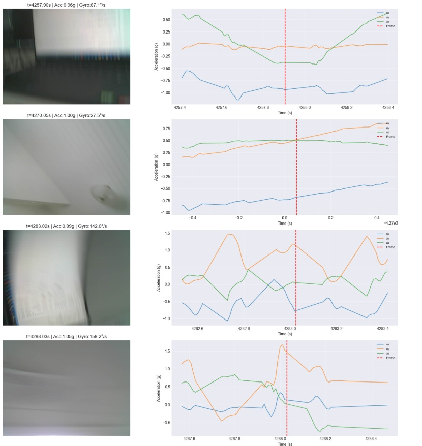

# ESP32 Camera + IMU Fusion System

Multi-sensor data acquisition and analysis system combining OV3660 camera and MPU6050 IMU on ESP32-WROVER. Demonstrates timestamped sensor fusion, embedded systems design, and Python data analysis.



---

## 🎯 Project Overview

This project captures synchronized camera frames and inertial measurement data from an ESP32, demonstrating:
- **Multi-sensor integration** - Camera (5fps) + IMU (40Hz actual, 100Hz target)
- **Timestamped data fusion** - Millisecond-precision synchronization
- **Complete data pipeline** - Firmware → Serial → Python → Visualization
- **Real embedded constraints** - Single-threaded loop, PSRAM buffering, serial bandwidth

**Tech Stack:** Arduino C++, Python, Jupyter, Pandas, Matplotlib

---

## 🔧 Hardware

| Component | Model | Specs |
|-----------|-------|-------|
| **MCU** | ESP32-WROVER | Dual-core 240MHz, 520KB SRAM, 4MB PSRAM |
| **Camera** | OV3660 | 640x480 VGA JPEG, I2C config, parallel data |
| **IMU** | MPU6050 | 3-axis accelerometer (±2g), 3-axis gyroscope (±250°/s) |

**Connections:**
- Camera I2C: GPIO 26 (SDA), GPIO 27 (SCL)
- IMU I2C: GPIO 13 (SDA), GPIO 14 (SCL)
- Serial: 921600 baud USB

---

## 🚀 Quick Start

### 1. Hardware Setup
Wire components according to pin definitions in `esp32_firmware/camera_imu_fusion/`

### 2. Flash Firmware
```bash
# Install Arduino IDE + ESP32 board support
# Required library: MPU6050_tockn (via Library Manager)

# Open: esp32_firmware/camera_imu_fusion/camera_imu_fusion.ino
# Board: ESP32 Wrover Module
# PSRAM: Enabled
# Upload
```
### 3. Capture Data
```bash
cd pc_scripts
pip install -r ../requirements.txt
python capture_fusion.py --port COM13 --duration 30
```
### 4. Analyze
```bash
jupyter notebook notebooks/analyze_fusion.ipynb
``` 
---
## 📁 Repository Structure
```text
esp32-imu-camera-fusion/
├── esp32_firmware/
│   ├── camera_imu_fusion/      # Main fusion firmware
│   ├── camera_serial/          # Camera-only test
│   ├── mpu6050_serial/         # IMU-only test
│   └── README.md               # Arduino setup guide
├── pc_scripts/
│   └── capture_fusion.py       # Serial data capture tool
├── notebooks/
│   └── analyze_fusion.ipynb    # Visualization & analysis
├── docs/
│   └── highlight_reel.png      # Demo screenshot
├── data/                        # Captured sessions (gitignored)
├── requirements.txt
└── README.md
```
---
## 📊 Data Protocol
### IMU Output (Text)
```text
IMU,<timestamp_ms>,<ax_raw>,<ay_raw>,<az_raw>,<gx_raw>,<gy_raw>,<gz_raw>
```
Example: IMU,7580,-152,-792,17200,121,334,27

Conversion:
- Acceleration: raw / 16384.0 → g (gravity units)
- Gyroscope: raw / 131.0 → °/s (degrees per second)

###  Frame Output (Binary)
```text
FRAME,<timestamp_ms>,<length_bytes>
<binary JPEG data>
FRAME_END
```
---
## 🔍 Key Findings
### Performance Characteristics
- Actual IMU rate: ~40Hz (vs 100Hz target)
- Frame rate: 5fps as configured
- Frame size: 10-12 KB (VGA JPEG)
- Transfer time: ~110ms per frame @ 921600 baud

### Single-Threaded Bottleneck
Camera capture (~150ms) blocks IMU sampling, creating timestamp gaps visible in CSV data. These gaps correlate exactly with frame timestamps, demonstrating the hardware constraint.

**Trade-off:** Simple single-loop design vs optimal sampling rate.

## 🚀 Future Improvements
### Phase 2: FreeRTOS Multi-Core (Planned)
- Run IMU on Core 0, camera on Core 1
- Eliminate blocking, achieve sustained 100Hz IMU rate
- Use queues for thread-safe data passing

### Phase 3: DMA Optimization (Planned)
- Non-blocking serial transmission via DMA
- Higher frame rates (10+ fps)
- Reduced CPU overhead

## 📚 Skills Demonstrated
- Embedded C++ - ESP32 Arduino framework, hardware drivers
- Sensor Integration - I2C communication, parallel camera interface
- Protocol Design - Mixed text/binary serial protocol
- Python - Serial I/O, CSV handling, binary file processing
- Data Analysis - Pandas, NumPy, Matplotlib, Jupyter
- Systems Thinking - Understanding hardware constraints, bottleneck analysis
- Git Workflow - Feature branches, meaningful commits, documentation

``` 
