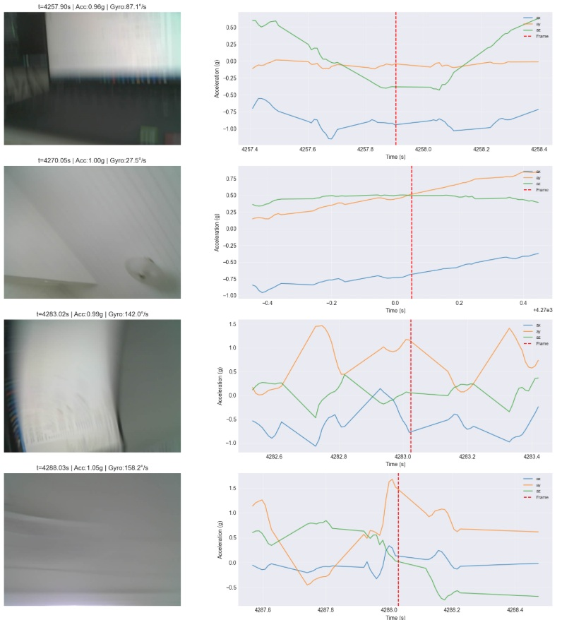

# ESP32 Camera + IMU Fusion System

Multi-sensor data acquisition and analysis system combining OV3660 camera 
and MPU6050 IMU on ESP32-WROVER. Demonstrates timestamped sensor fusion, 
embedded systems design, and Python data analysis.



---

##  Project Overview

This project captures synchronized camera frames and inertial measurement 
data from an ESP32, demonstrating:
- **Multi-sensor integration** - Camera (5fps) + IMU (~83Hz, FreeRTOS dual-core)
- **Timestamped data fusion** - Millisecond-precision synchronization
- **Complete data pipeline** - Firmware → Serial → Python → Visualization
- **Real embedded constraints** - FreeRTOS task isolation, mutex-protected serial, PSRAM buffering

**Tech Stack:** Arduino C++, FreeRTOS, Python, Jupyter, Pandas, Matplotlib

---

##  Hardware

| Component | Model | Specs |
|-----------|-------|-------|
| **MCU** | ESP32-WROVER | Dual-core 240MHz, 520KB SRAM, 4MB PSRAM |
| **Camera** | OV3660 | 640x480 VGA JPEG, I2C config, parallel data |
| **IMU** | MPU6050 | 3-axis accelerometer (±2g), 3-axis gyroscope (±250°/s) |

**Connections:**
- Camera I2C: GPIO 26 (SDA), GPIO 27 (SCL)
- IMU I2C: GPIO 13 (SDA), GPIO 14 (SCL) — separate bus from camera
- Serial: 921600 baud USB

---

##  Quick Start

### 1. Hardware Setup
Wire components according to pin definitions in `esp32_firmware/camera_imu_fusion_freertos/`

### 2. Flash Firmware
```bash
# Install Arduino IDE + ESP32 board support
# Required library: MPU6050_tockn (via Library Manager)

# Open: esp32_firmware/camera_imu_fusion_freertos/camera_imu_fusion_freertos.ino
# Board: ESP32 Wrover Module
# PSRAM: Enabled
# Upload
```

### 3. Capture Data
```bash
cd pc_scripts
pip install -r ../requirements.txt
python capture_fusion.py --port COM13 --duration 30
```

### 4. Analyze
```bash
jupyter notebook notebooks/analyze_fusion.ipynb
```

---

## 📁 Repository Structure
```text
esp32-imu-camera-fusion/
├── esp32_firmware/
│   ├── camera_imu_fusion_freertos/  # Phase 2 — FreeRTOS dual-core firmware (USE THIS)
│   ├── camera_imu_fusion/           # Phase 1 — single-threaded reference firmware
│   ├── camera_serial/               # Camera-only test
│   ├── mpu6050_serial/              # IMU-only test
│   └── README.md                    # Arduino setup guide
├── pc_scripts/
│   └── capture_fusion.py            # Serial data capture tool
├── notebooks/
│   └── analyze_fusion.ipynb         # Visualization & analysis
├── docs/
│   └── highlight_reel.png           # Demo screenshot
├── data/                             # Captured sessions (gitignored)
├── requirements.txt
└── README.md
```

---

##  Data Protocol

### IMU Output (Text)
```text
IMU,<timestamp_ms>,<ax_raw>,<ay_raw>,<az_raw>,<gx_raw>,<gy_raw>,<gz_raw>
```
Example: `IMU,7580,-152,-792,17200,121,334,27`

Conversion:
- Acceleration: raw / 16384.0 → g (gravity units)
- Gyroscope: raw / 131.0 → °/s (degrees per second)

### Frame Output (Binary)
```text
FRAME,<timestamp_ms>,<length_bytes>
<binary JPEG data>
FRAME_END
```

---

##  Key Findings

### Phase 1 vs Phase 2 Performance

| Metric | Phase 1 (single-threaded) | Phase 2 (FreeRTOS dual-core) |
|--------|--------------------------|------------------------------|
| IMU actual rate | ~40Hz | ~83Hz |
| IMU gap during frame (still) | ~150ms | ~355ms* |
| IMU gap during frame (moving) | ~150ms | ~700ms* |
| Root cause | CPU blocked by camera | Mutex contention on Serial |
| Architecture | Single `loop()` | Dual-core FreeRTOS tasks |

*See Known Limitations below.

### FreeRTOS Architecture
- **IMU task** pinned to Core 0 — uninterrupted sampling at ~83Hz
- **Camera task** pinned to Core 1 — independent 5fps capture
- **Mutex** protects all Serial output — prevents data corruption from 
  simultaneous writes
- **Staggered init** — camera task delayed 3s to avoid I2C contention 
  during MPU6050 gyro calibration

### Known Limitations

**Mutex contention on Serial:**  
The camera task holds the Serial mutex for the entire JPEG write. A 
moving scene produces larger JPEGs (up to ~35KB vs ~20KB static), 
causing the IMU task to wait up to 700ms for mutex access. This is 
visible as large timestamp gaps in the CSV during motion.

*Fix (Phase 2.5):* Serial TX queue — camera posts frame pointer to a 
FreeRTOS queue; a dedicated TX task handles transmission, releasing the 
IMU task after only ~1ms mutex hold.

**IMU rate below 100Hz target:**  
`vTaskDelay(10ms)` does not account for task execution time, resulting 
in ~12ms actual intervals (~83Hz).

*Fix:* Replace with `vTaskDelayUntil()` for precise periodic scheduling.

---

##  Planned Improvements

### Phase 2.5: Serial TX Queue
- Dedicated serial transmission task
- Camera posts frame to queue and immediately releases
- IMU mutex hold time reduced from ~700ms → ~1ms

### Phase 3: DMA Serial Transmission
- Non-blocking serial via DMA
- Higher frame rates (10+ fps)
- Reduced CPU overhead
- Prerequisite: Phase 2.5 complete

---

##  Skills Demonstrated
- **Embedded C++** - ESP32 Arduino framework, hardware drivers, FreeRTOS
- **RTOS Design** - Dual-core task pinning, mutex, semaphores, deadlock prevention
- **Sensor Integration** - I2C communication, parallel camera interface
- **Protocol Design** - Mixed text/binary serial protocol
- **Debugging** - Breadcrumb prints, ESP32 panic dump analysis, race condition diagnosis
- **Python** - Serial I/O, CSV handling, binary file processing
- **Data Analysis** - Pandas, NumPy, Matplotlib, Jupyter
- **Git Workflow** - Feature branches, PRs, meaningful commits, documentation
